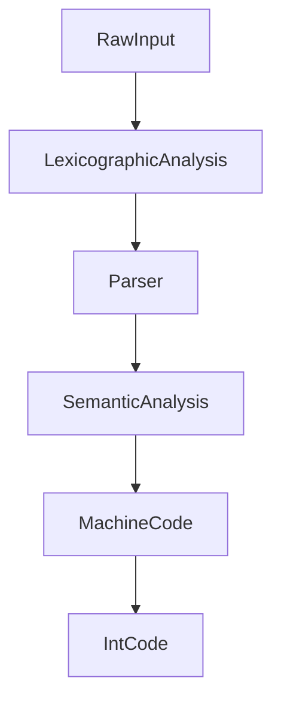

# Java-Like IntCode Compiler
After Day 9 of 'Advent Of Code' the constructed IntCode machine is capable of functioning as a stack machine. As a result, I have implemented a small compiler in Haskell to take a Java-like tiny language to function on the IntCode Machine. You may use this code to run on your own machine, however if you haven't completed Day 9 feel free to use my implementation. 

> ***NB*** scroll down for instructions on running the compiler

To recap - the machine was already able to perform basic operations such as Add and Multiply. Added to this were comparisons and conditional jumps. Then, on day 9, a 'relative base' was introduced whilst also asking for the implementation to store values outside of the original memory. This all gave the machine the capabilites of storing variables and - but if we wanted to create a custom script, writing 
```
[9,27,21101,5,0,2,22101,0,2,0,21101,1,0,2,1206,2,26,21101,5,0,4,204,4,1105,1,26,99]
```
 seems like a lot of effort, as compared to 
```javascript
var x;
x := 5;
if(true){
    print(x);
}
```

> ***NB*** those programs are equivalent

Thus I have created a compiler which takes this little Java-like language to the IntCode machine. I have currently supported variables for both Integer and Boolean primitives, 'While' and 'For' loops, and a 'Print' statement. This allows use of most of the functionality of the IntCode machine, although I would like to implement user input in the future.
### Language Syntax
The small language has a few quirks. I'll cover the syntax required to write a program in it.
#### Variables
Before a variable is accessed, it must be initialised - this is my simple way of allowing the compiler to find all the variables in the program.  Assignment uses the symbol ```:=``` rather than ```=``` - this is entirely due to my own preference.  

>***NB***   you cannot declare a variable and assing to it in a single statement.

```javascript
bool x; //A Boolean Variable
var y; //An Integer Variable

x := true;
y := 10;
```
> ***NB*** comments can be written using ``` // Comment ```

#### Statements
Like most languages, this small language supports ```if```, ```while``` and ```for``` statements, the syntax of which are as follows:
```javascript
var x;
x := 5;
if (x >= 1){
    print 7;
}
for (x := 5; x < 10; x := x + 1;){
    print x;
}
while(x > 0){
    print x;
    x := x - 5;
}
```
Naturally, the output of this program is ```7,5,6,7,8,9,5```. A For loop takes a initial value, a condition and how to increment a value. 
>***NB*** there is a third semi-colon in the condition of the ```for``` statement.

>***NB*** often an error from the parser generally indicates a missing semi-colon - unless specified otherwise

#### Operators
While the IntCode machine only supports Addition, Multiplication, LessThan and Equality, these can be manipulated to serve with all expected numerical operators ```+```, ```-```,```\```,```*```,```>```,```<```,```>=```,```<=```,```==```,```!=``` along with logical operators ```||```,```&&```,```!```. Precidence is as to be expected, but bracketing ensures meaning.

## How to run

To begin, compile the compiler using:

```ghc Compiler.hs MachineCodeGen.hs SemAn.hs parser.hs lexer.hs -main-is Compiler -o compile -O ``` 

Write and save your code file, following the syntax above, into a text file. Eg:

```javascript
var x;
for (x := 0; x < (100 / 2); x := x + 2;){
    print x;
}
```
and save this file as ```code.txt```

Now simply run the following command

```./compile``` 

and when prompted enter your filename.
You will recieve the output ready for your IntCode machine.

## Compiler

The compiler translates the users input to a form of Machine Code, from which the IntCode instructions are derived. There are multpile extensions that are possible with the current implementation. 



This graph shows the simple cycle of the compiler. The machine code almost directly represents the IntCode.
